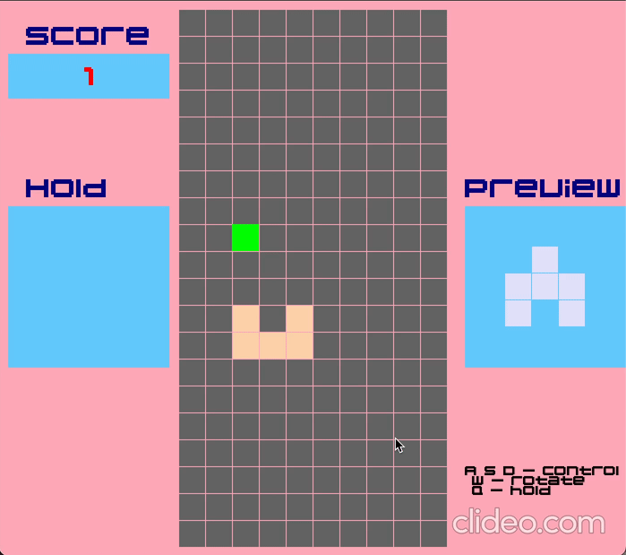

# Custom Tetris Game

A feature-rich Tetris clone with unique gameplay mechanics, built from scratch using C++ and SFML.



## Features

### Core Gameplay
- **10 Custom Tetrimino Shapes** - Unique piece designs beyond the standard Tetris set, including plus signs, arrows, zigzags, and pyramids
- **Smooth Controls** - Responsive movement with A/D keys, soft drop with S, and instant drop with Space
- **Next Piece Preview** - See what's coming next to plan your strategy
- **Progressive Difficulty** - Game speed increases with each line cleared

### Unique Mechanics

#### Portal System
A green portal spawns randomly on the board. When your piece touches it:
- The piece instantly drops to the bottom (free fall)
- You earn bonus points based on the distance fallen
- A new portal spawns at a different location

This adds an element of unpredictability and rewards strategic positioning.

#### Hold System
- Press **Q** to hold your current piece and swap it with the held piece
- Limited to **3 holds per piece** to maintain strategic depth
- Held piece is displayed in the left panel

#### Rotation Limits
- Each piece can only be rotated **5 times** maximum
- Encourages thoughtful piece placement rather than infinite spinning
- Visual warning when rotation limit is exceeded

### Scoring System

| Action | Points |
|--------|--------|
| Clear 1 line | 100 |
| Clear 2 lines | 300 |
| Clear 3 lines | 500 |
| Soft drop (per cell) | +1 |
| Hard drop (per cell) | +1 |

## Controls

| Key | Action |
|-----|--------|
| **A** | Move left |
| **D** | Move right |
| **S** | Soft drop (move down faster) |
| **W** | Rotate piece clockwise |
| **Q** | Hold/swap piece |
| **Space** | Hard drop (instant fall) |
| **Enter** | Restart (after game over) |

## Screenshots

<!-- Add your screenshots here -->
<!--


-->

## Installation

### Prerequisites
- C++17 compatible compiler (g++, clang++)
- SFML 3.x library

### macOS (Homebrew)

```bash
# Install SFML
brew install sfml

# Clone the repository
git clone https://github.com/beyzaelbb/CustomTetrisGame.git
cd CustomTetrisGame

# Build and run
g++ -std=c++17 -o tetris *.cpp -I/opt/homebrew/include -L/opt/homebrew/lib -lsfml-graphics -lsfml-window -lsfml-system -lsfml-audio
./tetris
```

### Linux (Ubuntu/Debian)

```bash
# Install SFML
sudo apt-get install libsfml-dev

# Clone and build
git clone https://github.com/beyzaelbb/CustomTetrisGame.git
cd CustomTetrisGame
g++ -std=c++17 -o tetris *.cpp -lsfml-graphics -lsfml-window -lsfml-system -lsfml-audio
./tetris
```

### Windows

1. Download and install [SFML 3.x](https://www.sfml-dev.org/download.php)
2. Clone this repository
3. Configure your IDE/compiler to link against SFML libraries
4. Build and run

## Project Structure

```
CustomTetrisGame/
├── main.cpp          # Entry point, game loop, event handling
├── game.cpp/.hpp     # Core game logic, scoring, piece management
├── board.cpp/.hpp    # Grid management, line clearing, rendering
├── pieces.cpp/.hpp   # Tetrimino definitions and movement
├── 04B_20__.TTF      # Retro pixel font
├── beep.wav          # Rotation sound effect
├── clear.wav         # Line clear sound effect
└── Makefile          # Build configuration
```

## Architecture

The game follows an object-oriented design with three main classes:

- **`Grid`** - Manages the 20x10 game board, handles line detection/clearing, and renders the playing field
- **`Tetriminos`** - Represents individual pieces with their shape matrices, colors, and movement logic
- **`Game`** - Orchestrates gameplay, manages piece spawning, collision detection, scoring, and the portal system

## Technical Highlights

- **Custom Collision Detection** - Per-cell collision checking for precise piece placement
- **Dynamic Difficulty** - Game speed increases by 40ms per line cleared
- **State Management** - Clean separation between game states (playing, game over)
- **Audio Integration** - Sound effects for rotation and line clears using SFML Audio

## Built With

- **C++17** - Modern C++ features
- **SFML 3.x** - Simple and Fast Multimedia Library for graphics, window management, and audio

## License

This project is open source and available under the [MIT License](LICENSE).

## Acknowledgments

- Font: 04B_20 by Yuji Oshimoto
- Built as a personal project to learn game development with C++ and SFML
